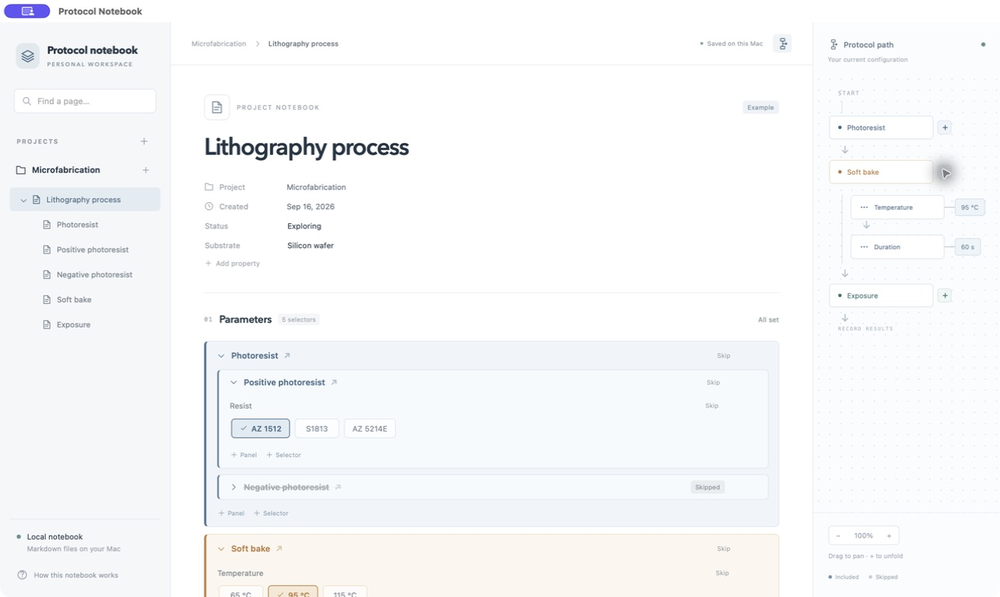

# Protocol notebook

Local Mac notebook for engineering protocols. Built with Tauri, React, and TypeScript. This is an early MVP for exploring parameterized procedures and experiment history.



## What it does

- Organize projects and arbitrarily nested pages.
- Define ordered, skippable panels and discrete parameter selectors.
- Write Markdown procedures with interactive `/panel` and `/page` references.
- Keep results and unfinished drafts attached to their parameter configuration.
- Preserve an exact protocol snapshot for each saved experiment.
- Explore the current procedure with an expandable, pannable path map.

## Run on your Mac

Install Node.js/npm, Rust/Cargo, and Apple's command-line developer tools before building. Dependencies are installed inside the project; notebook data stays on your Mac.

For development with live updates:

```sh
git clone https://github.com/enochpage/protocol-notebook.git
cd protocol-notebook
npm ci
npm run tauri dev
```

The example lithography page demonstrates the interface only; it is not a validated fabrication protocol. Create your own project with the + beside Projects.

If Cargo is not found, load your Rust environment with `source "$HOME/.cargo/env"` and try again.

The app saves Markdown pages and experiment history in `data/vault` inside the source project folder. This private directory is excluded from Git. Close the app before editing those Markdown files externally. The MVP's vault location is tied to the project used to build the app; a portable vault picker is not implemented yet.

For browser preview, run `npm run dev` and visit `http://127.0.0.1:1420`. Browser data is independent from the Mac app.

## Build a standalone Mac app

```sh
npm run tauri build -- --debug --bundles app
```

Open `src-tauri/target/debug/bundle/macos/Protocol Notebook.app`. The packaged app does not need a running development server. This produces a local development build, not a notarized distribution release. Generated app bundles and personal notebooks are not included in this repository.

## Verify

```sh
npm test
npm run build
cd src-tauri
cargo test
```

See [the MVP specification](docs/MVP.md) for behavior, persistence, and current limits.

## Continuing development with Claude Code or Codex

Start in this repository and read [HANDOFF.md](HANDOFF.md). It records completed work, accepted design decisions, verification boundaries, and remaining gaps.

[AGENTS.md](AGENTS.md) contains shared development instructions; [CLAUDE.md](CLAUDE.md) imports them for Claude Code. Both assistants are instructed to update the same handoff after substantive work. Use one assistant at a time in a shared checkout, and use Git checkpoints to preserve reviewed changes. Private chat histories are not required to continue.
